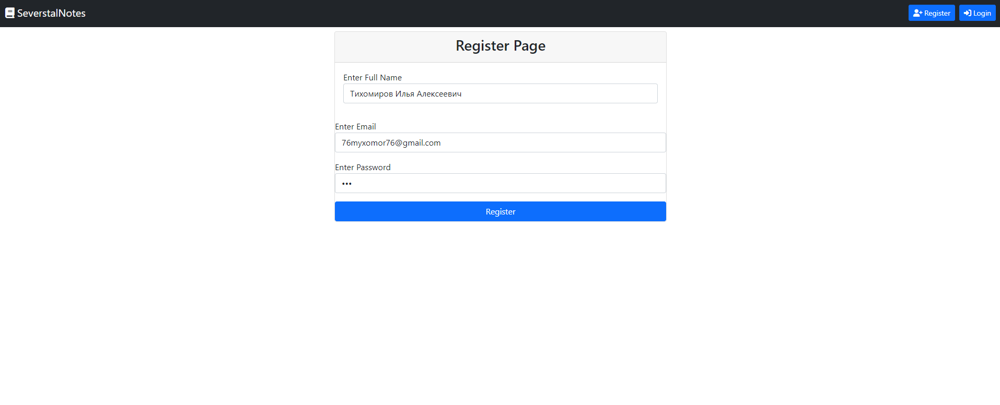
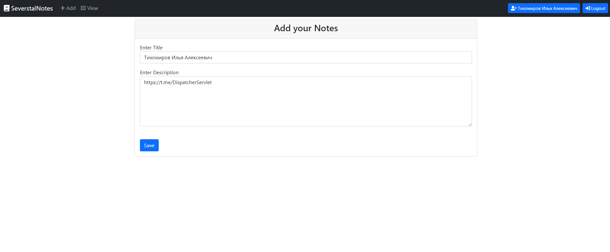
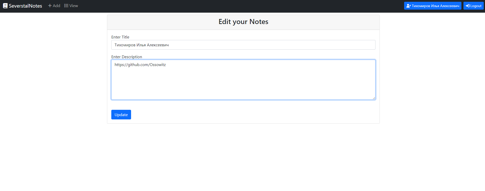
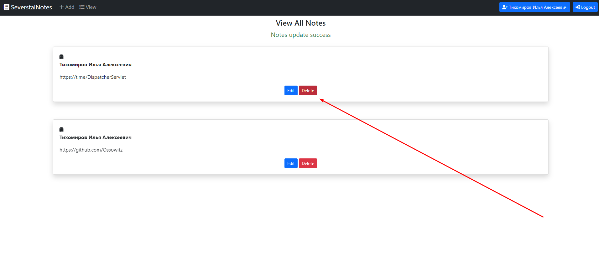

### _A MVC Notes application:_
- Stack: [JDK 17](http://jdk.java.net/17/), Spring Boot 3.0, Docker, Lombok, HSQLDB (for fast deployment), Maven.

### _Steps to launch app:_

```shell
# Clone the project
git clone https://github.com/Ossowitz/SeverstalNoteTask.git
```

```shell
mvn deploy
```

```shell
# You must have Docker in machine
docker-compose up
```

_Open in browser_ http://localhost/

### Instructions



After success registration join to Login page:




Ability to view the list of notes and add a new one:


Ability to edit:



Ability to delete:



